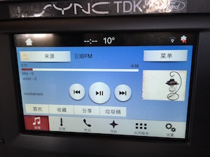

豆瓣FM 连接 [SDL](https://github.com/QiuZhiFei/sdl_ios) Demo。



## Installation with CocoaPods

```
gem install cocoapods
pod install
open ZFSmartDeviceLink-iOS.xcworkspace/

```


## DEBUG 

> - [JxbDebugTool](https://github.com/JxbSir/JxbDebugTool) APP 左上角，点击可以查看 crash、system log
> - [NSLogger](https://github.com/fpillet/NSLogger) 修改 appdelegate 里的 ip

## 遗留问题

> - 1 菜单 - hotchoice 二级菜单无法正常展示
> - 2 不添加 globalproperties ，只添加 command ，也是显示菜单帮助的，而且使用正常，是否还有必要添加 globalproperties
> - 3 第一次播放的歌曲，有时 mediaclocker 设置成功了，车机『有时』不展示
